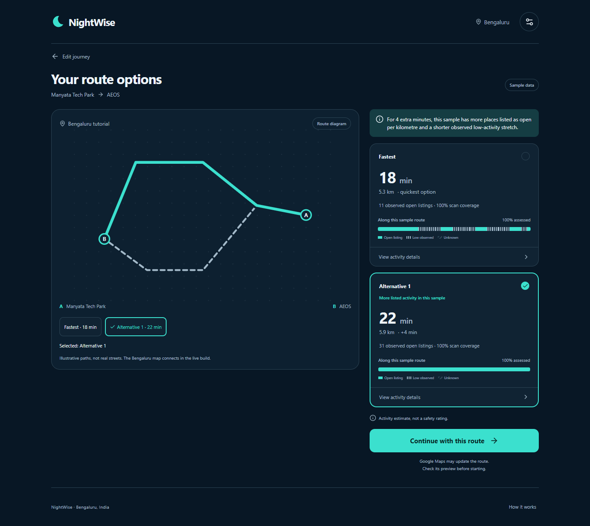
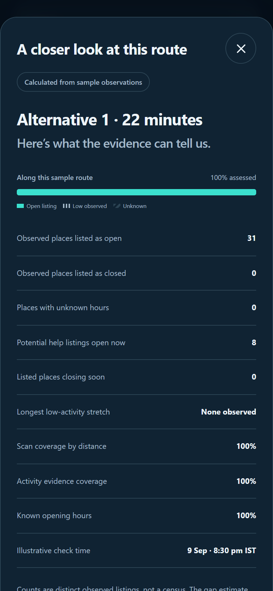

# NightWise Module 3 activity comparison

9 September 2026 IST  |  M03 revision 1  |  Prepared by Codex for the project owner

Module 3 is complete within its sample-data scope. Activity counts, coverage, gaps and route comparisons are now calculated from independent test observations. The complete suite passed 34 unit tests and 14 browser tests. The localhost preview contains the working M2 and M3 flow. These tests do not establish live Bengaluru conditions, a calibrated safety score or physical-phone behavior.

## What I built

- Polyline sampling at an initial 200 m spacing, with both endpoints, final short segments, repeated points, bends and loops handled. Exactly identical sample locations reuse a query within the comparison; the request plan is capped at 120 unique queries.

- Place deduplication by ID while retaining all route-sample associations. Out-of-radius observations are filtered. Failed, stale, truncated or conflicting evidence stays incomplete; all-unavailable evidence produces unavailable counts.

- Opening-hours evaluation in an explicit timezone, including overnight and week-wrap schedules, close boundaries, overlapping periods and soon-closing listings. Missing hours never silently become open or closed. The visible sample clock is 9 September 2026 at 8:30 pm IST.

- Distance-weighted scan and activity coverage plus low-observed-activity sections. Unknown sections split gaps. The overall longest-gap estimate is withheld when the route cannot be fully assessed.

- A versioned experimental comparison model with the same available components and denominator for every alternative. Density normalization prevents longer routes from earning points merely through more listings. Ties, large detours, incomplete evidence and soon-closing listings have separate outcomes.

- Calculated route summaries, patterned activity strips and a scrollable evidence sheet. The sheet explains counts, unknown hours, potential help categories, coverage, evidence time and limitations. Numeric scores remain internal while calibration and permitted live use are unresolved.

## Approach and reasons

I separated pure geometry, hours, observation analysis and comparison from the React interface. M2 still owns the journey and selected route. The same route ID feeds the diagram, cards, evidence and handoff. Synthetic provider inputs exercise the actual analysis code; the earlier fixed evidence totals have been removed.

Four Higgsfield illustrations and a local launch poster were prepared before M2/M3 work. Their source jobs and prompts remain under assets. Blue remains the default; monochrome themes use the same interactions and labels. Real Google rendering, place search and requests belong in M4.

## Verification and issues resolved

All 34 unit tests passed. They cover route bounds and cancellation; final-segment geometry; loops and dateline interpolation; query reuse; duplicate places and conflicting details; opening-hours boundaries and overnight periods; stale, missing and capped scans; distance-weighted coverage; unknown-separated gaps; common scoring components; density normalization; ties; detours; and different evaluation times.

All 14 browser tests passed across M1–M3. They verify both origins and the exact AEOS handoff coordinates, synchronized keyboard selection, zero/one/three-route states, cancel/retry behavior, theme persistence and storage denial, narrow/desktop layouts, calculated evidence, missing-data and soon-closing states, local assets and absence of provider requests in the tutorial.

The first analysis run had 31 passing tests and one failure: a repeated fixture listing had been recreated with open hours even when its original record was closed. The analyzer correctly rejected the conflict. I changed the fixture generator to reuse the original observation; the final expanded suite passes.

The first full browser run passed 13 checks and failed a theme assertion that assumed Alternative 1 would always be the default among three routes. The detour rule can correctly preserve Fastest. The test now explicitly chooses Alternative 1 and verifies that theme switching preserves that choice. No selection behavior was changed to satisfy the mistaken expectation.

Review also found an explanation edge case: with three routes, a small advantage elsewhere could incorrectly describe Fastest as the strongest. I separated that case into a similar-evidence outcome and added a regression test. The final browser runner reported 14 passed with 5.5 hours of elapsed time, despite short individual case timings. The cause of that elapsed-time gap was not independently established; it must not be treated as active execution time or app latency.

## Model limits and package evidence

This initial model requires complete usable core evidence for an activity recommendation and suppresses one when a listing may close soon. The normal three-component denominator is 55. Experimental normalizers are 8 open places/km, 2 help listings/km and a 1,500 m gap scale. Differences below 10 internal points are treated as similar; an alternative exceeding either 10 extra minutes or a 35% detour is not selected automatically. These constants are uncalibrated hypotheses, documented in planning/nightwise-activity-model.md.

The updated Android build passed in 2 minutes 43 seconds, with 168 tasks. The debug APK is output/apk/nightwise-module-03-debug.apk, version 0.3.0-module3, 9,367,765 bytes. Package identity, signature, all four bundled illustrations and the launch poster were verified. SHA256 is e665247578da73453f5e1d7cc9c83ef0979809623df7789c58338215ae4c3068. Existing flatDir and SDK XML compatibility warnings were nonfatal. The earlier Module 1 APK is preserved.

No physical Android phone, live map, real opening-hours coverage, API billing or field rehearsal has been validated. The supplied office pin is known; the Manyata gate, Sahakar Nagar starting landmark, AEOS road entrance and intended phone still need local confirmation. No API keys are required to review this tutorial milestone.

## Calculated comparison in the browser

## Files and next module

The canonical root remains D:/Aevy TV ( Achina Mayya )/Nightwise. Core analysis is in src/domain/geometry.ts, hours.ts, activity.ts, comparison.ts and analyze-comparison.ts. Synthetic observations are in src/data/activity-fixtures.ts. UI integration is in src/App.tsx and src/ActivityStrip.tsx. Tests are in tests/unit and tests/browser.

Read planning/nightwise-current-status.md, the module plan and talks/README.md after context loss. M4 is next: restricted credentials, provider adapters, budgets and the actual Bengaluru map. Live activity ranking remains disabled until the data-use and calibration decisions are resolved.

## Scrollable evidence and local preview

Open http://localhost:4173 or http://127.0.0.1:4173 on this computer. If the preview has stopped, run Preview NightWise.cmd in the project root. It starts a local background server without exposing it to the network. After source changes, run npm run build to refresh the production preview.
