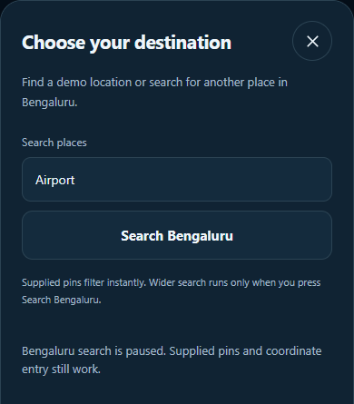
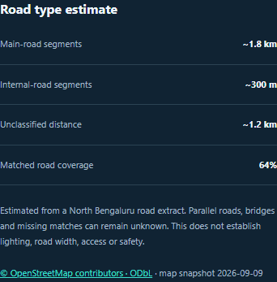

# NightWise search roads and Android checkpoint

9 September 2026   M4 and M5 revision 2   Live and phone acceptance pending

We completed the implementation and checks that can proceed while Google billing is paused. The app now searches the supplied demo pins locally, has a prepared Bengaluru place-search connection, and estimates road classes using a local OpenStreetMap extract. The updated Android APK is built and verified. These results do not establish a working live recommendation or a physical-phone pass.

## Search and cost controls

Local filtering handles AEOS, Manyata and common spelling variants without a request. Wider search runs only after the user presses Search Bengaluru. Its Google Autocomplete and Place Details adapters use bounded sessions, allow only offered place IDs and enforce a Bengaluru coordinate check. Persistent limits allow 40 suggestion attempts and 20 detail attempts across the pilot. Existing route and nearby counts are preserved when reading the older ledger.

A server pause switch blocks Routes and Places requests before dispatch. A separate build setting blocks embedded Google map creation on web and Android. All these switches remain off. The server credential is configured privately; no key values are in this report, screenshots or source exports. The ledger still contains one earlier rejected route attempt and zero nearby, autocomplete and detail attempts.

## Road classification approach

One public Overpass download supplied 13,542 mapped road ways around the North Bengaluru corridor. The raw data and provenance remain local with OpenStreetMap attribution. The classifier uses highway tags, distance and alignment. Conflicting parallel roads, bridges, tunnels and unmatched sections remain unknown. At least 95 percent classified coverage is required before passing a main-road fraction to the score model. These thresholds still need real-corridor calibration.

## Verification and known limits

All 65 unit and backend tests passed. The full browser run reported 31 passing checks and the additional road-evidence check passed. Browser results use controlled provider fixtures. The test workers were slow to close after completion; this was investigated as test-browser cleanup, not represented as a phone test. The OSM file smoke test measured 42 percent classified coverage on one map way, illustrating the conservative unknown handling; it is not field accuracy evidence.

## Actual application evidence

## Android package and errors

Version 0.6.0-prebilling compiled successfully in 2 minutes 22 seconds. The APK signature and packaged web assets were checked, and the server key is absent. No background-location permission is present. A first static check incorrectly expected every Google loader URL to disappear; Capacitor retains dormant loader code. The check was corrected to distinguish packaged library text from runtime invocation, which the paused-map browser test verifies.

Physical-phone testing was deferred by the user. Gradle flatDir and SDK XML-version warnings remained non-fatal. Initial patch applications that did not match source text made no edits and were corrected. Search sessions, paused calls, malformed data, missing road coverage and parallel-road ambiguity are covered by tests.

Important files: src/PlaceSearch.tsx, src/PointPicker.tsx, src/domain/roads.ts, server/search.ts, server/roads.ts, server/budget.ts and output/apk/nightwise-prebilling-debug.apk. Open planning/M04-live-setup.md for future activation. Billing, successful provider access, live scoring review and calibration, and the intended-phone checks remain outstanding.
