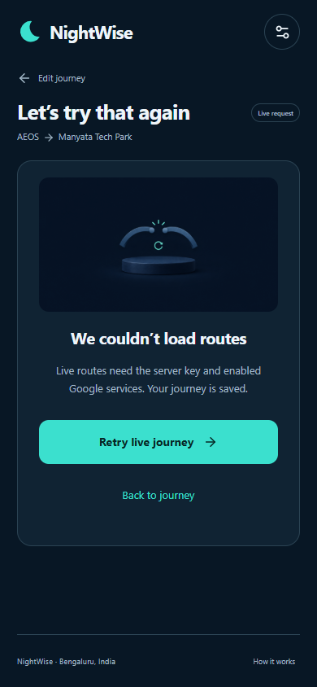
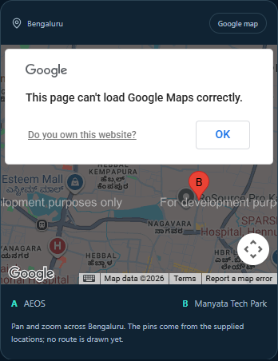

# NightWise M4 provider integration checkpoint

9 September 2026 IST | Implementation built | Live acceptance pending

M4 implementation is built and tested with controlled provider responses. Live acceptance is incomplete: the browser map returned BillingNotEnabledMapError, the separate Routes and Places server credential is absent, and live activity scoring still needs provider-use review and local calibration. No Routes or Places requests have been sent.

## What was built

The app now defaults to AEOS to the supplied Manyata Tech Park pin and offers separate tutorial and live modes. A full Bengaluru Google map can be opened on demand. The frontend calls a Node and Fastify backend for traffic-aware driving alternatives and nearby place scans. Coordinates, route shapes and provider responses are bounded and checked. Destination and origin pins are editable without paid autocomplete queries.

The backend samples every 200 metres, reuses identical sample coordinates, deduplicates place IDs and interprets current opening information conservatively. Failed, capped and uncertain observations stay unknown. The PDF’s total low-activity distance is now included, alongside longest stretch and coverage. Actual turn counts are parsed where provided; main-road classification is still unmeasured.

## Budget and evidence decisions

Default limits are 10 route attempts and 600 nearby attempts across the whole pilot, with at most 120 nearby requests in one comparison. The entire scan plan must fit before nearby calls begin. A persistent, exclusive ledger counts failures and cancellations before dispatch and does not reset on restart. Only one comparison runs at a time; at most three nearby calls run concurrently. There are timeouts and no automatic provider retries. Map loads are separate from this backend ledger.

Tutorial mode makes no Google requests. Live scans and live scoring have separate switches. Scores are visible for clearly labelled sample data; live scoring remains withheld by default. Provider results stay in memory, and the ledger stores counts only. Client map keys are in ignored local configuration and required application builds; no key values are in this report or recovery notes.

## Verification and errors

The production web build passed, all 52 logic/backend tests passed, and all 26 Edge browser checks passed. The new tests cover durable limits, access and origin checks, malformed geometry, failed calls, incomplete scans, location denial and cancellation. An initial five-second configuration test timed out; the exact cause was not proven. Its startup allowance was increased to 15 seconds and the full rerun passed. Google Maps type declarations were added after the compiler identified missing types.

## Browser evidence

The computer-control bridges still fail with a kernel-assets path error, so Google Cloud was not operated. Billing settings were untouched. One real map-script load was attempted; the backend ledger remains at zero route and zero nearby calls. No real route latency or charge estimate has been measured.

Next: follow planning/M04-live-setup.md to enable billing and configure the restricted server key locally. Then validate one real AEOS to Manyata comparison, measure coverage, latency and usage, and resolve the data-use/scoring approach. Key source files: server/app.ts, server/google.ts, server/budget.ts, src/LiveMap.tsx, src/providers/live.ts and src/domain/activity.ts. M4 remains an implementation checkpoint, not a completed live milestone.
