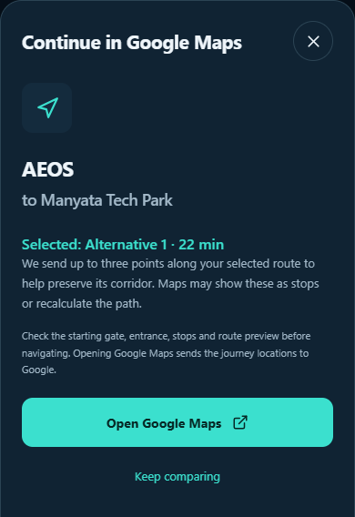

# NightWise M5 Android handoff checkpoint

9 September 2026 IST | APK verified | Intended phone acceptance pending

M5 Android implementation is built and packaged. Physical-device acceptance is incomplete: no authorized Android phone was visible over USB at the final device check. The signed debug APK is ready for private review, but installation, native map layering, Back/resume and the actual Google Maps corridor must still be checked on the intended phone.

## What was built

Android now has the Google Maps SDK key configured through a private local property file, plus foreground coarse/fine location permissions. There is no background location permission. The map component supports native transparency and disables map touch while a sheet is open. Back dismisses the intro or current sheet, cancels an active comparison or returns to the journey screen; on the home screen it minimizes the app.

Current location is a one-time action with a timeout, an accuracy check, a Bengaluru bound and a pin fallback when permission is declined. It is not sent to the backend until Compare is pressed. Returning to results older than five minutes shows a refresh action without spending another request automatically. Backgrounding an active native comparison cancels it.

The external handoff prefers the Google Maps Android app and falls back to a browser. It opens a directions preview rather than automatically beginning navigation. Up to three ordered points from a live selected route help retain its corridor; Google Maps may treat them as stops or choose a different path. Sample paths are never sent as real road geometry. The preview asks the user to check the gate, entrance and route.

## Build and verification

Final package: nightwise-module-05-pilot-debug.apk. Package ID: in.nightwise.demo. Version: 0.5.0-pilot. Size: 9,495,092 bytes. The final incremental Gradle build succeeded in 2 minutes 30 seconds. Signature verification passed; every packaged web asset matched the current dist build, the native MapsHandoff code was present, and the Android map key matched its local configuration without being printed.

The full suite passed 52 logic/backend tests and 26 browser tests. The 18 provider/handoff unit tests and six live-flow browser checks also passed in focused reruns; the final six browser checks ran against the final APK web bundle. Browser tests use controlled provider responses and simulated location permissions, so these results are not physical-phone or live-route acceptance.

Gradle reported non-fatal flatDir and SDK XML-version warnings. npm audit reported three moderate advisories in the Capacitor CLI/xcode/uuid development chain, including a uuid buffer-bounds advisory. These are outside the packaged app runtime and backend; the locked toolchain was retained during this Android checkpoint. No new generated media was needed.

## Handoff preview and phone review

Connect the intended phone, enable USB debugging and accept its authorization prompt. Then scripts/connect-phone.ps1 -Install installs the APK and forwards API port 8787 over USB. Keep the local backend running. The debug network exception allows loopback only. Team use away from USB needs an HTTPS backend; no public service has been deployed.

On the phone, verify the full launch clip, location allow/deny, blue and mono appearances, native map visibility and touch under sheets, Back behavior, leaving/returning to results, and both selected-route previews in Google Maps. Confirm the actual Manyata public gate and AEOS approach. Billing and the separate server key from the M4 setup guide are also needed for live comparisons.

Files: src/native.ts, src/domain/handoff.ts, src/LiveMap.tsx, src/App.tsx and android/app/src/main/java/in/nightwise/demo/MapsHandoffPlugin.java. APK certificate details are in output/apk/module-05-signing.txt; checks and SHA-256 are in module-05-verification.json. The earlier M3 APK remains preserved. M6 rehearsal and M7 final team delivery have not started.
