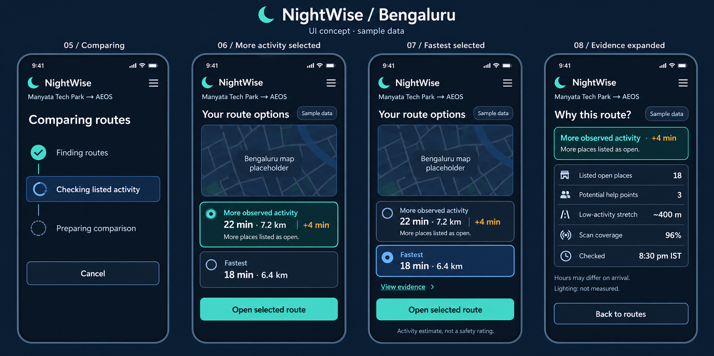
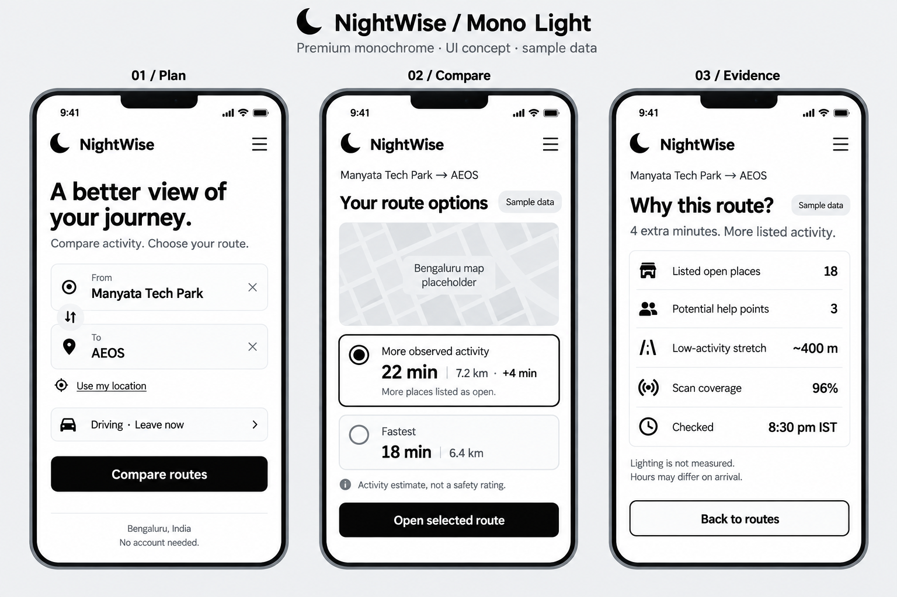
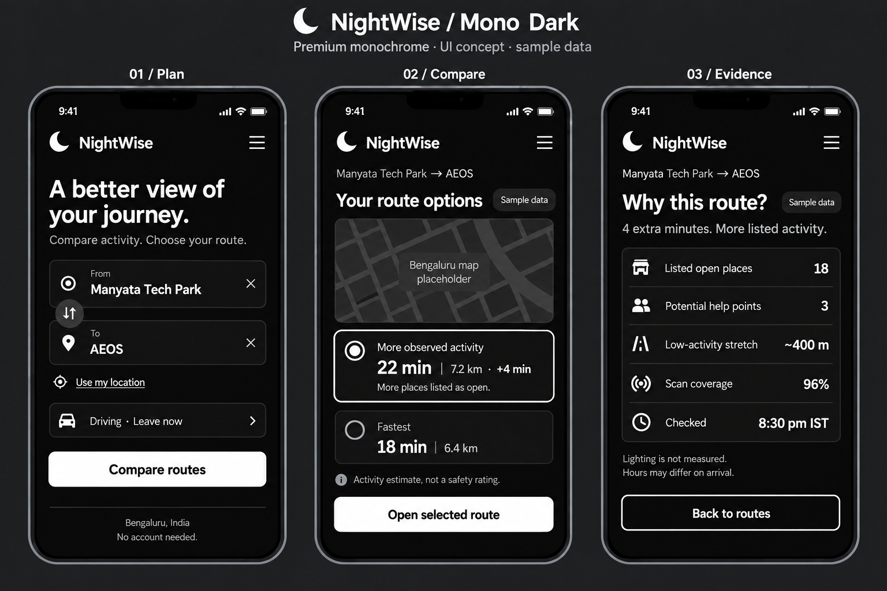

# NightWise preparation checkpoint

9 September 2026 IST  |  P00 revision 1  |  Prepared by Codex for the project owner

The preparation pack is ready to guide implementation. The user has selected the original blue and navy theme with teal accents, with optional Mono Light and Mono Dark appearances. The Android foundation is still in progress. This checkpoint preserves completed research and design work and records the setup issues; it is not a completed M0 handoff.

## Scope and decisions

Build an Android tutorial app for at most ten users within the requested 48 to 72 hour handoff window. Keep iOS optional until Android is ready. Use Bengaluru with focused demo journeys from Manyata Tech Park and Sahakar Nagar to AEOS. The user supplied AEOS latitude 13.0628268 and longitude 77.5940888. Exact origin gates, the office road entrance and travel mode still need confirmation; driving is provisional.

The default appearance is the original blue theme. Add black and white options and remember the selection locally. The core purpose is to compare available routes and explain observed activity and uncertainty. Activity evidence must not be presented as a safety guarantee.

## Work completed and approach

- Read the full roadmap and grouped its twelve responsibilities into M0 to M7, preserving a mapping to the original modules. The reduced Android scope reserves time for an early compilation, live checks and tutorial rehearsal.

- Prepared Bengaluru and Chennai research notes, source files, a cited research PDF, a UX specification and a validation plan. Historical city audits inform design; they do not establish current conditions around AEOS.

- Created six UI boards covering 24 principal states, plus two monochrome comparisons. These are generated design references with sample values and map placeholders, not implemented app screenshots.

- Copied 42 preparation files to the requested D drive project with matching SHA256 hashes. Preserved the original PDF, launch reference and earlier C drive preparation files.

- Generated a four second navy launch background with Higgsfield and saved it under assets/launch. Keep text and branding as real UI overlays. Motion inspection, fallback and integration remain pending.

## Setup issues and what is known

The first npm install exited with Cannot read properties of null reading edgesOut inside its peer dependency resolver. The stack trace establishes where it failed, but the exact root cause is not yet proven. The retry updates the React Vite plugin to its Vite 8 compatible release, pins Vitest and uses a locally cached newer npm. Installation and compilation must pass before M0 can be marked complete.

The Adoptium Java download endpoint returned HTTP 403 before tool installation. That response shows the source was inaccessible from this environment; the access-control cause was not established. The next attempt uses Microsoft's official JDK 21 distribution. Android command-line tools and the Java archive are downloaded to D drive to avoid consuming the limited C drive space. Verify checksums and compile before claiming the toolchain is ready.

Google credentials and billing are intentionally deferred at the user's request. This is a pending integration dependency, not a failed API test. No real route alternatives, opening-hours coverage, provider latency, cost measurement or phone handoff has been validated.

## Evidence and files

All paths below are relative to D:/Aevy TV ( Achina Mayya )/Nightwise. The current status file and actual build evidence take precedence over older checkpoint wording.

- planning/nightwise-72-hour-modules.md holds scope, order and completion criteria. planning/nightwise-ux-spec.md holds the current theme decision and behavior.

- research/nightwise-bengaluru-research.md and output/pdf/nightwise-bengaluru-research.pdf hold the research and source citations. research/sources holds supporting material.

- planning/nightwise-ui-state-index.md maps the generated concepts. assets/launch/nightwise-launch-navy-concept.mp4 holds the generated background; generation-record.json records its source job.

## Resume from this checkpoint

Read AGENTS.md, planning/nightwise-current-status.md and talks/README.md, then the newest handoff. Consult planning and research as needed. Verify installed dependencies and tool versions, finish M0, then implement the app shell with the blue default and optional monochrome themes. Request restricted credentials at M4 when live requests can actually be tested.

After each completed module, save a dated Word report and matching Markdown source in talks. Include the work, approach, errors and their known or suspected causes, fixes, verification, meaningful screenshots, remaining tasks and user dependencies. Preserve older revisions and never include secrets.

## Approved blue direction

This generated concept board records the blue and navy direction selected by the user. Rebuild the interface using real text and controls. The map area and route values are illustrative.

## Launch asset

The local launch clip is a background concept. Final use requires a short, skippable presentation, muted playback, a static fallback and reduced-motion handling. The app must open without waiting for a network video stream.

## Optional monochrome appearances

