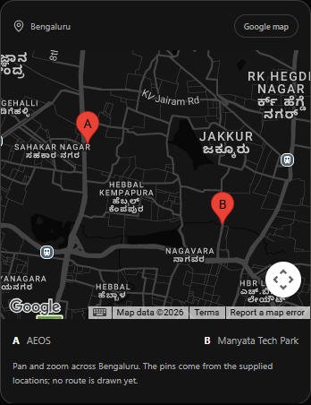
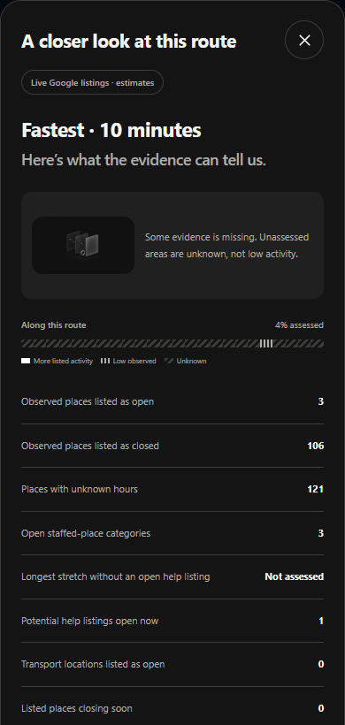

# NightWise live integration test results

10 September 2026 | Live integration checkpoint | Activity scoring not accepted

For the NightWise project owner and implementation team. Live Google access, browser maps, route alternatives and destination search passed. Full nearby scans completed, but the returned evidence is incomplete and live activity recommendations are not ready for release. All provider switches were restored to paused after this bounded test. The phone was disconnected, so native and field acceptance remain pending.

## What passed live

- The browser map rendered with 50 loaded map images and no reported Google map error. Black, Light and Blue map appearances and the desktop layout passed.

- AEOS to Manyata returned two real route alternatives. The reverse journey returned three. A destination selected from a live search also returned a route, confirming the backend is not hardcoded to the demo preset.

- Two autocomplete requests and two place-resolution requests succeeded. Both Manyata and a Hebbal railway station query returned suggestions. The first offered result was used for the technical test; its public entrance and suitability were not field-validated.

- Route selection, evidence display and the Google Maps handoff URL passed. The URL retained AEOS as origin, Manyata as destination and corridor waypoints. This test did not prove that the external phone app preserves the exact route.

- Unauthorized requests and outside-Bengaluru inputs were rejected. The browser reported no unhandled runtime errors. No server keys were printed or included in screenshots.

## What did not pass acceptance

The activity pipeline ran successfully but returned partial evidence for all five alternatives in the forward and reverse journeys. The experimental scoring flag remained off. Independently, the observed coverage also fails the current complete-evidence requirements. No live activity score or recommendation was published.

Known-hours coverage was about 42 to 55 percent and complete scan coverage about 50 to 74 percent. Numerous searches reached the 20-result cap. North Bengaluru road matching ranged from about 31 to 95 percent across the alternatives; the two forward routes matched about 84 and 90 percent. Some turn classifications were unknown or unavailable.

## Actual live test screenshots

Left: the real browser Google map around the supplied pins. Right: the activity details returned by the live scan, displayed through an in-memory replay of that same response to avoid another paid comparison. It is real provider evidence, not a synthetic fixture. The visible sheet is only its top portion.

## Requests and safeguards

This validation used five Routes requests, 141 nearby requests, two autocomplete requests and two place-detail requests. One of the nearby requests was the malformed smoke request; the corrected smoke and subsequent scans returned no provider errors. The browser loaded the Maps script once and created maps for three themes. Map usage is separate from the backend request ledger. These counts are not a rupee bill; actual charges must be checked in Cloud Billing.

The cumulative local ledger now contains seven route attempts, 141 nearby attempts, two autocomplete attempts and two details attempts. The initial limits remain ten Routes and 600 nearby requests; they were not increased or reset. The temporary test backend required an unpredictable access code, applied additional per-run ceilings and was closed afterwards. Private environment flags remain paused. No GitHub push, hosting or billing change was performed.

## Failures and interpretation

The first nearby smoke request incorrectly passed a location display name with latitude and longitude. Google rejected that request with HTTP 400. Sending only latitude and longitude corrected it. The production query planner already emits coordinate-only points; this was a test-harness mistake, not a failed Places credential.

Opening-hour uncertainty is partly a modeling limitation: repeated responses included openNow values without a next closing time. The present evaluator requires a closing horizon before treating those entries as usable through the journey. These are not automatically closed places. Source-level missing hours and capped search results also remain. Do not relax these conditions merely to obtain a score.

## Verification and next work

All 85 unit/backend checks passed again. The full 38-check browser regression was rerun after restoring the paused build. The existing 0.6.3 APK remains the review build; this test made no app-source changes. Its previous physical-phone evidence belongs to 0.6.2, not a new live Android validation.

- Before releasing live scoring, separate current open status from arrival-time uncertainty, define a transparent comparison method for capped or incomplete evidence, and improve or constrain road coverage. Recheck provider-use requirements before publishing a derived score.

- Reconnect the Android phone for native map rendering, key restriction verification, Back-button and GPS permission checks, and a real external Maps handoff. No native test was possible during this run.

- The PDF still requires 10 to 20 real Bengaluru journey validations and two or three proven reel demos. These stationary API tests do not verify public entrances, driving restrictions, actual staff, physical conditions or selected-path preservation. Review measured usage with the owner before increasing any allowance.

- Use planning/nightwise-current-status.md and the records live-validation.json and live-activity-validation.json in talks/records to recover this checkpoint. Screenshot files are in talks/screenshots/live-validation. No additional keys are required at present.
