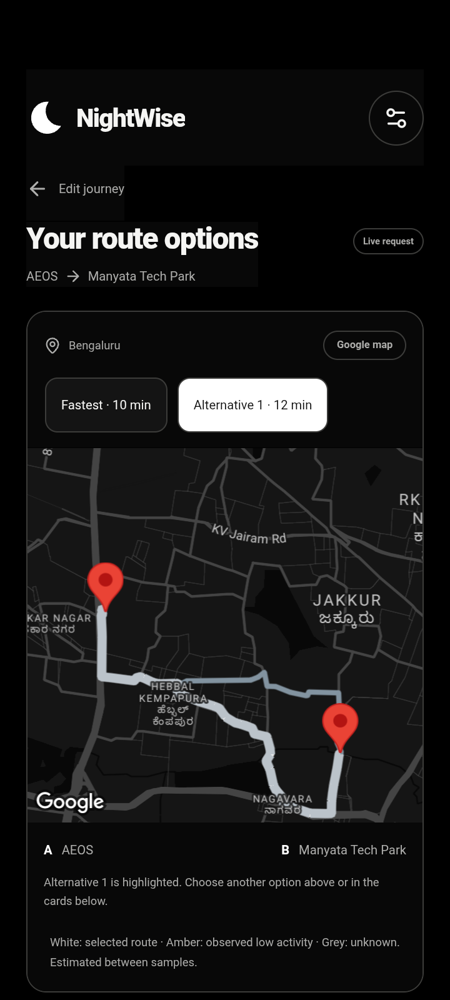
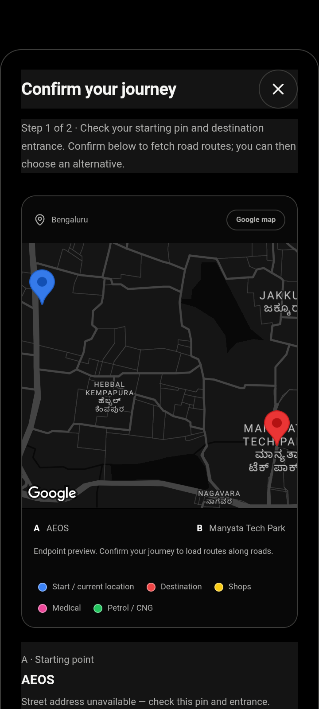

# NightWise journey features and Android verification

10 September 2026 | M4 and M5 preview checkpoint | Version 0.7.6

Prepared by Codex for the NightWise owner and reel team. The seven agreed journey features and map corrections are implemented in Android preview 0.7.6. This handoff records what works and what still needs acceptance. It does not claim full PDF completion. Community shops and voting remain deferred, as reconfirmed by the user.

## Implemented features

- Flexible journeys across Bengaluru, optional current location, endpoint swap and an AEOS to Manyata reset. Bengaluru Palace replaces GrowthSchool as the search example.

- Endpoint confirmation shows both pins, available addresses and coordinates before fetching routes. Map selectors and route cards change the same selected road route.

- Evidence confidence stays separate from activity scores. Live confidence, help and freshness panels explain unavailable evidence instead of disappearing or using tutorial values.

- Open help listings cover pharmacies, hospitals and petrol pumps. Supported analysis includes the longest gap without a listed open help point and estimated passing times.

- Extra time choices of 0, 5, 10 or 15 minutes and saved places persist locally. Google favourites store place IDs and user labels; their details are resolved again.

- Black is the default, with remembered Light and Blue alternatives. The intro has no Skip button. Android hides system bars, preserves cutout and keyboard space, and uses smoother transitions.

- Map pins use blue for origin, red for destination, yellow for shops, pink for medical listings and green for fuel stations. A labelled legend supplements colour. Available scheduled-open observations supply business pins; fuel listings do not guarantee CNG availability.

## Opening hours and evidence

Schedules are evaluated at estimated passing time, including overnight periods and dated exceptions. Capped searches can show positive observations but cannot prove an empty stretch. Missing hours and road data remain unknown. Live scoring remains withheld until evidence supports a useful comparison; activity is never presented as a safety guarantee.

## Verification results

All 98 unit and backend tests passed. The complete browser run passed 43 tests before the final map refinements; 11 focused journey and live-map browser tests passed after the pin changes. Frontend, backend and Android builds succeeded. APK 0.7.6 signature, bundled web assets and absence of the server key were verified. It was installed on the connected Redmi Android 10.

Earlier phone checks passed themes, time-preference persistence, saved-place storage and removal, comparison controls, native map scrolling and external Google Maps launch. The final APK visually shows blue and red endpoint pins and the legend. Business colour classification has automated coverage; no new paid shop scan was run for native business-pin verification.

A fresh Google request on version 0.7.3 returned two real paths with 303 and 305 vertices: 4795 m / 602 s and 5381 m / 717 s. Selection changed the highlighted road route. The latest APK retains this geometry code, but its installation cleared the live result. Attempts to preserve the result across installation failed; no replay on version 0.7.6 is claimed.

## Problems and corrections

- Final scroll inspection found the confirmation button had inherited a dark panel background. Excluding buttons from that native panel rule restored its white background and dark text. Version 0.7.6 was installed and the corrected contrast was verified on the Redmi.

- Native maps render below the WebView. Opaque dialog areas hid the map, and nested sheet scrolls were missed by the plugin. Transparent map windows, opaque text panels and forwarded ancestor scroll events now keep the map aligned. Listener cleanup and map ownership tracking prevent overlapping maps from interfering.

- Moving map ancestors caused bound mismatches. Their transforms are suppressed during map presentation. Redmi redraws also dropped text and SVG icons on transparent layers; isolated paint layers and opaque text and icon surfaces corrected the observed issue.

- A response without shop analysis hid sections and left the details action ineffective. Those sections now show clear unavailable-evidence states and a functioning details sheet.

- Synthetic test lines caused confusion. Fresh Google paths verified the real roads. Activity overlays and gap-marker placement now retain provider vertices instead of drawing straight chords between sampling points.

- Two attempts to retain a live result during APK installation failed: first the debugging socket was not ready, then a process lookup ran before the app started. The approved extra request restored the result on 0.7.3; the later installation cleared it again. No further route request was made. A final screenshot script used an incorrect dialog locator; correcting the test selector completed the confirmation check.

## Usage and publication

This enhancement work used four Routes and 155 nearby requests. Cumulative ledger: 11 Routes, 296 nearby, 2 autocomplete and 2 details. The user approved one request beyond the original ten-route cap, with zero shop scans; it was used exactly once. The route allowance is exhausted. Native maps were also opened; exact charges require Cloud Billing. Backend requests and live scoring are paused.

Source is published at https://github.com/defaultF1/Nightwise/tree/codex/journey-updates, commit a914d5a, preserving the MIT licence. Private configuration, APKs, reports and phone screenshots remain local. GitHub holds source only; it does not host the API service.

## Remaining acceptance work

- Validate the public entrances, alternatives and representative journeys in Bengaluru. The user is in Kanpur, so phone checks here cannot establish route suitability there.

- Improve and validate incomplete opening-hours, scan and road evidence before enabling live scores. Do not lower evidence requirements just to display a recommendation.

- Verify a successful location fix and physical Android Back behaviour. Permission was granted but no GPS fix returned. The app showed location recovery. This phone blocks injected Back key events, so manual verification remains.

- Verify the exact selected route after Google Maps handoff. App launch and endpoint URL checks passed; Google may recompute the route.

- Choose and configure an HTTPS backend destination for independent team phones. The current local backend relies on the laptop; GitHub publication does not solve this.

- Run any further paid validation only after another explicit request allowance. Community submissions, voting and optional iOS remain deferred.

## Local deliverables and recovery

Installable preview: output/apk/nightwise-0.7.6-debug.apk. SHA256: f810f46d8cb5e7437fe979c4e93dceb773c5fe0b12fc7cec5f32aaded37e89bd. Packaging checks are in the adjacent versioned verification JSON.

Read planning/nightwise-current-status.md and talks/README.md first. Main implementation files include src/App.tsx, src/LiveMap.tsx, src/maps/adapter.ts, src/maps/pins.ts, src/maps/scroll-sync.ts, src/domain/geometry.ts, src/domain/hours.ts, server/opening-hours.ts, server/search.ts and Android MainActivity.java. Test evidence is in talks/records/native-073-real-roads-check.json and native-076-ui-check.json.

The app is ready for further preview review. Full PDF acceptance remains open for the evidence, field, device and hosting checks above. No additional credentials are requested in this handoff.
