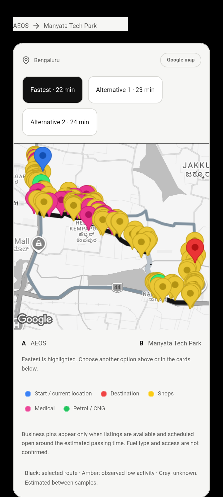
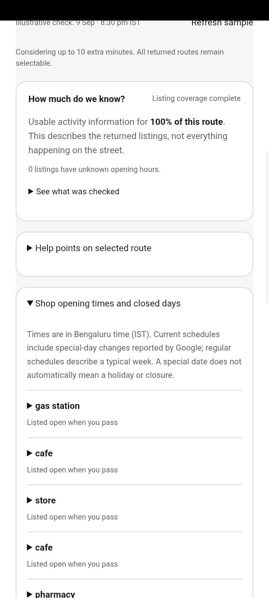

# NightWise phone and live test results

M06 follow up 10 September 2026
Prepared by Codex for the NightWise project owner

The Redmi 9 completed an authenticated AEOS to Manyata comparison against the hosted Render service. Google returned three real routes and the app displayed live activity score ranges. Testing found a Mono Light readability defect, which was fixed in Android 0.9.1 and checked on the phone. Physical Back and exact road preservation after opening Google Maps remain unverified.

## Phone and live results

- Version 0.9.0 obtained a native location reading and correctly rejected it as outside the North Bengaluru pilot, retaining AEOS. The user is in Kanpur. Location settings opened successfully. A real in-area GPS journey was not tested.

- Live comparison at 15:30 IST returned 3 provider routes with 305, 220 and 303 geometry points. Google time and distance were displayed; selecting Alternative 1 worked. Score ranges were 58–98, 53–94 and 58–93 out of 100 in displayed order. Overlap correctly produced no activity winner.

- Complete scans covered 50–74% of route distance, usable opening hours covered 60–70% of listings, activity assessment covered 74–85% of route distance, and road matching covered 76–90%. These are separate measures. The daytime software test does not establish night-time street conditions.

- The assumed 9 am–8 pm schedule was visible and clearly excluded from confirmed-open evidence. Rounded confirmation, scrolling, endpoint colours, evidence panels, stale-result warning and Google Maps launch were exercised. Returning to NightWise preserved the result on 0.9.0.

## Usage

The phone comparison used 1 Routes request, 117 Nearby requests and 4 Place Details requests. Shared totals immediately afterwards were 20 Routes, 987 Nearby, 2 Autocomplete and 10 Details against caps of 30, 1500, 40 and 20. No cap was raised. Map loads are separate and exact charges require Cloud Billing.

## Corrections and verification

Mono Light shop-hours and help panels inherited transparent backgrounds above the native map, leaving dark text on black. Version 0.9.1 adds opaque panel surfaces. It also limits dense business marker displays to a representative set of up to 48, retaining medical and fuel categories. Full listings and scoring inputs remain unchanged. The density limit passed a unit test; a dense live map was not re-requested after this display change.

All 138 unit and backend tests passed. The browser run passed 44 of 46 cases; two tests expected paused maps while port 4173 served a live-enabled build. Both passed on a separate paused-map server at port 4174. Thus all 46 current browser cases have passing results across these runs. TypeScript, frontend build, Android build and package verification passed.

Version 0.9.1 was installed with code 22. Six focused phone checks passed: installed version, saved light theme through upgrade, authenticated backend readiness, opaque result panels, native endpoint map and rounded clipping, and restoration of Mono Dark. The surface regression used tutorial content with the native-map CSS state forced; the separate endpoint check used a real native Google map. The full paid comparison was on 0.9.0, whose backend and analysis code are unchanged.

## Remaining acceptance limits

MIUI rejected ADB hardware key injection with INJECT_EVENTS permission errors. On-screen close and activity resume were checked, but they do not prove physical Back behavior. Google Maps opened the selected Alternative 1 journey; the exact roads shown by Maps were not compared with the app polyline. Final 0.9.1 handoff was not repeated. No app JavaScript errors were recorded during the successful live flow. The brief post-restart log check found no fatal crash, and is not a long-duration stability test.

Ground checks and reel shooting remain excluded by the user. In-area native GPS, physical Back, dense pin layout on the final build, and exact Maps road preservation remain specific follow-ups. Missing provider evidence remains visible in score ranges and gap ranges. Community submissions and voting remain excluded.

## Files and delivery

APK: output/apk/nightwise-0.9.1-team-debug.apk. SHA256: ebb0c784bfee508443ae9ce2125b5cf454eac993167031562bc391566b0f31d7. Source correction commit: 6b14b60 on codex/journey-updates. Affected files: src/journey-updates.css, src/LiveMap.tsx, src/maps/pins.ts, tests/unit/map-pins.test.ts, android/app/build.gradle and scripts/verify-current-apk.py. Evidence records: talks/records/phone090-acceptance.json and phone091-smoke.json.

## Actual Redmi screenshots

