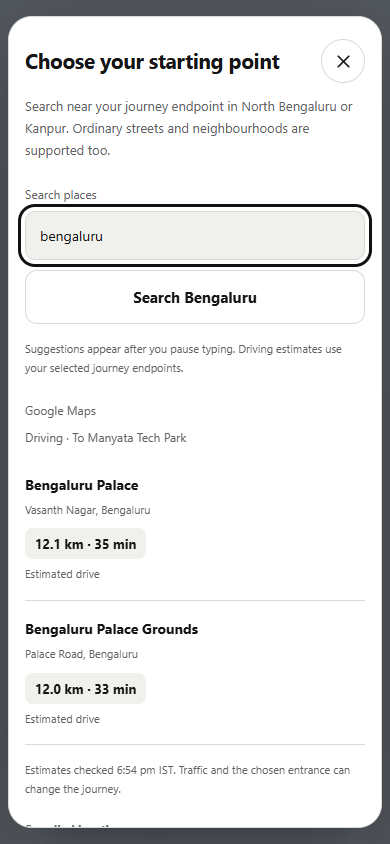
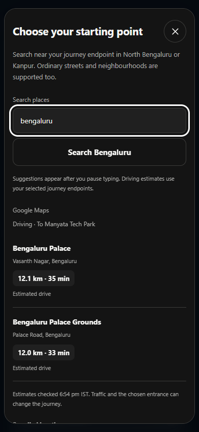

# NightWise Kanpur journeys and live search

M08 10 September 2026
Prepared by Codex for the NightWise project owner
Implemented and live tested on Redmi

M08 adds live Kanpur journeys and place suggestions with driving estimates. The Bengaluru presets and offline tutorial stay unchanged. Android 0.11.1 completed a real Kanpur GPS, address, school search, driving estimate and three-route comparison on the Redmi. The final 0.11.2 package clears a completed GPS loading message. This report separates automated checks, the live device run and remaining evidence limits; it does not claim a validated safety rating.

## What changed

- Kanpur has a 20 km product coverage circle centred at 26.48 N, 80.30 E, intended to cover the requested Sharda Nagar, Vinayakpur, Rajeev Nagar, Indrapuri, Gurudev Palace, Rawatpur, Kakadeo, Keshavpuram and Kalyanpur areas. This is not an administrative boundary. Actual entrances are resolved through Google search rather than invented presets.

- Use my location accepts a fresh, precise Kanpur GPS fix. Android attempts an approximate address lookup in a background thread; a failed or slow address lookup retains the GPS position and accuracy. Cross-city journeys require a new destination. No background location permission is added.

- Live search begins after three characters and a 700 ms pause. Up to five suggestions appear, followed by Google driving distance and duration when available. Origin searches calculate travel toward the selected destination; destination searches calculate from the selected origin. Missing estimates do not block selection or become guessed travel times.

- Kanpur uses the existing live shop scanning, hours, help points, score ranges, unknown-evidence handling and Maps handoff. Missing hours stay unknown for confirmed activity. Fixed tutorial activity remains confined to Tutorial mode.

## Road evidence and resource use

A 22 km OpenStreetMap query returned 40,160 ways and 354,837 geometry points. The compact 15.7 MB extract retains original geometry and highway/elevation tags, with source query, timestamp, hashes and ODbL attribution. Kanpur uses a latitude-adjusted distance projection. Only the active city road index is retained in memory for the free hosted server.

The local index check loaded successfully, used approximately 284 MB RSS including the raw audit data, and matched one selected mapped street completely. This is a loader self-check, not an independent route or ground validation. The snapshot timestamp is 2026-09-10T13:20:41Z.

## Verification and known limits

All 155 unit/backend cases are covered by passing runs. Two existing tests timed out at five seconds during concurrent building/report rendering; both passed on the focused 21-test rerun without assertion changes. Resource contention is suspected. The nine focused browser cases passed after correcting one test selector. Coverage includes region boundaries, cross-city rejection before provider use, Kanpur shop and route parsing, matrix ordering, request caps, stale-search cancellation, GPS address fallback, permission refusal, saved places and preservation of the Bengaluru tutorial.

Frontend, backend and Android builds passed. APK checks verify the signature, matching web assets, HTTPS endpoint and absence of the server key and background location permission. Real Redmi GPS resolved an approximate Kanpur address and correctly required a Kanpur destination. The exact private home address and coordinates are excluded from this report and source. Final 0.11.2 device smoke passed all seven GPS, address, city, comparison-blocking, layout and completed-message checks without paid requests.

## Operational decisions and errors

The approved Place Details cap of 100 is active in Render and was verified in the live response. Routes and Nearby caps stayed at 30 and 1500. Matrix estimates consume one route-budget unit per origin/destination pair and refuse a batch that would leave no comparison unit. Completed identical estimates are reused in memory for 90 seconds.

Initial OSM requests returned HTTP 406 or 429. The main endpoint succeeded after supplying an application User-Agent and Accept header; its exact server rule is unknown. Browser control failed with a local kernel-assets path error, so the owner changed Render and deployed. The Redmi initially appeared offline but subsequently reconnected. The first short Maps focus check did not confirm launch; a repeat using resumed-activity detection confirmed Google Maps opened and the selected route survived return. Exact road preservation inside Maps remains unverified. The first debugger connection immediately after the final APK restart closed its socket; reconnecting after startup passed the smoke check.

## Live results and remaining checks

- The school resolved to Dr. Virendra Swarup Education Centre, Sharda Nagar, Kanpur. Its live search preview returned 1,088 m and 209 seconds. The comparison returned three Google alternatives of 979–1,094 m and 220–240 seconds, each with 24–25 geometry points. Selection updated the native map.

- All planned scans completed without result caps on this journey. Usable hours covered 76.2–81.3% of listings, activity assessment covered 59.1–73.1% of route length, and road matching covered approximately 99.6–100%. Scores ranged approximately 50–65 and overlapped, so no activity winner was claimed. A complete scan does not mean every shop has usable hours or that every road segment can be assessed.

- This run used two route calculations (one matrix element plus one comparison), 15 Nearby, one autocomplete and five Details requests. Shared totals are 25/1307/3/25 against caps 30/1500/40/100. Five route units remain. Test other neighbourhoods and actual entrance accuracy separately; physical Back and exact Google Maps road preservation remain unverified. Field/reel and community/voting are outside scope. Exact charges require Cloud Billing.

## Search interface checks

## Files and sources

Main changes: src/domain/journey.ts, src/domain/location.ts, src/native.ts, src/PlaceSearch.tsx, src/App.tsx, server/search.ts, server/app.ts, server/roads.ts, src/domain/roads.ts, Android DeviceSettingsPlugin.java and data/roads/kanpur-22km.json. Tests: tests/unit/kanpur.test.ts, native-location.test.ts, search-preview.test.ts and tests/browser/kanpur.spec.ts, search-preview.spec.ts. Records live under talks/records; secrets and device screenshots are excluded from source export.

Primary references: developer.android.com/reference/android/location/Geocoder; developers.google.com/maps/documentation/places/web-service/reference/rest/v1/places/autocomplete; developers.google.com/maps/documentation/routes/reference/rest/v2/TopLevel/computeRouteMatrix; openstreetmap.org/copyright. The Sharda Nagar school website is vsecsharda.in; the live Google result identified that branch; physical entrance access is still unchecked.

Final package: nightwise-0.11.2-team-debug.apk (9,657,409 bytes), version 0.11.2 code 28. SHA256 251a180322b245fa1491d87911a8542cd54e590717ef7cb8c139b51e81a5ce68. Published source: 3f710f6 on codex/journey-updates. The full live comparison used client 0.11.1 and hosted backend 0.11.0; 0.11.2 changes only the completed GPS message and has a separate device smoke record.
