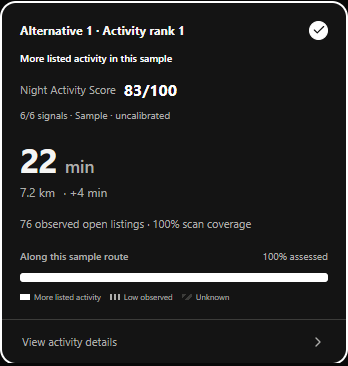
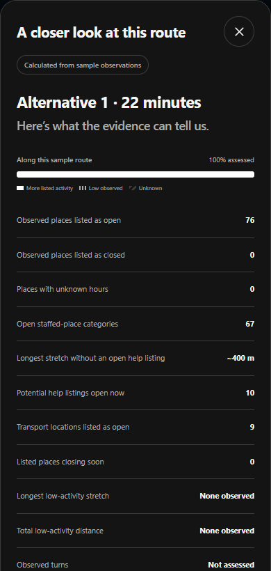

# NightWise PDF implementation handoff

10 September 2026 | Version 0.6.3 prebilling | Local implementation and validation

For the NightWise project owner and implementation team. The PDF work that can be completed locally has been implemented and checked with fixtures. The app remains a prebilling tutorial, not a validated live route recommendation service. The user has deferred GitHub publishing, hosting and the seven proposed enhancements.

## What changed

- PDF modules 7 and 8: added a separately labelled count of open staffed-place categories, a longest help-point gap, and a provisional low-activity threshold of fewer than two confirmed-open listings per sample. Unknown evidence is kept separate.

- PDF modules 3 and 9: retain step distances, maneuvers and available step polylines. Match turn geometry against the North Bengaluru road extract to estimate turns entering internal roads; missing and ambiguous matches remain unknown.

- PDF module 10: return a complete score ranking, display each activity rank and keep the recommended route first. Help gaps and staffed-category evidence affect the existing help component; estimated turns onto internal roads increase the simplicity penalty when comparable.

- PDF modules 1 and 11: expose the new measurements and explain the scoring inputs. Group low-activity stretches for map labels. Web labels are visible on the map; native marker titles and details are available on tap, pending live rendering validation.

## Existing behavior preserved

No login. Black is the fresh-install default; Light and Blue preferences persist. The local intro has no Skip button and normally plays to completion, with reduced-motion and media-failure recovery. The AEOS to Manyata tutorial remains synthetic. Missing data, closing hours and excessive detours do not force a recommendation. All live service switches remain off.

## Analysis choices and limits

Sampling remains about 200 m with a 150 m nearby radius. The threshold of two open listings is provisional. Adjacent samples estimate the distance between them; neither activity gaps nor help gaps are surveyed street measurements. Staffed-place categories indicate the kind of establishment, not verified employees or assistance.

The six PDF weights remain 25 for open density, 20 for main roads, 15 for help, 15 for activity continuity, 15 for simplicity and 10 for transport. Help evidence combines help-point density at 75% and staffed-category density at 25%, with up to a 50% reduction for a help gap reaching 2 km. Field testing must calibrate these choices.

Turn penalties use provider maneuver counts plus estimated turns entering internal roads. The additional road-specific adjustment is applied only if it is available for every alternative. Main-road share already accounts for internal-road exposure. Travel time controls recommendation and detour gates; it is not a seventh weighted signal. Missing signals stay absent and the remaining common weights are rescaled.

## Roadmap adaptations

General caching of Places results is not implemented. Google restricts caching beyond permitted exceptions, while place IDs are exempt. The existing per-comparison query deduplication and usage limits remain. Source checked 10 September 2026: developers.google.com/maps/documentation/places/web-service/policies. This is a documented deviation from the PDF caching suggestion, not an unfinished cache to switch on.

Standalone Geocoding is optional in the PDF. The current implementation uses a selected place-search result or coordinates. Actual staffing cannot be verified from category data. The full Bengaluru map is supported when enabled, but road evidence remains limited to North Bengaluru. Chennai test examples are replaced by Bengaluru under the user instructions.

## Errors and fixes

Two earlier scoring tests failed because their synthetic inputs changed open/help counts while leaving the newly added staffing and help-gap measurements at empty-scan values. The fixtures now supply consistent evidence and test the revised arithmetic. New tests check gap penalties, unknown boundaries, ranking, turn matching and step retention. A Windows text-decoding error while refreshing notes was resolved by specifying UTF-8.

The Android build retains the lower 768 MB heap and one worker after the previous session encountered memory pressure. The final package is rebuilt after the last source change so its bundled web assets can be checked byte for byte. Gradle flat-directory and SDK XML-version warnings remain non-fatal.

## Actual browser screenshots

These captures show the implemented tutorial, not generated design concepts or live measurements of AEOS and Manyata. The evidence screenshot shows the visible top portion of the details sheet; additional scoring and limitations appear below it.

## Verification and deliverables

85 unit/backend tests passed. The 37 existing browser tests and one new PDF-specific browser test passed; the affected seven browser checks were rerun after the final scoring changes. Browser location tests use mocked permission and coordinates. The packaged Node backend was checked locally while paused. Docker itself is unavailable on this computer, so a container image has not been validated.

The local deliverables are the 0.6.3 prebilling debug APK, its signature and asset-verification record, a refreshed source archive excluding secrets, updated planning notes, this Word report and its Markdown source. The APK verification checks the package/version, signature, all current web assets, absence of the server key and absence of background-location permission. No hosted service or GitHub push was performed.

## What remains before live acceptance

- Billing and controlled API validation: confirm billing, verify restrictions, test one route request, embedded map, explicit place search and capped nearby scans in stages. Review provider usage before increasing allowances for the wider field test. Keep experimental scoring off until provider-use review and local calibration are resolved.

- Real-route validation: test 10 to 20 Bengaluru journeys, including AEOS to Manyata and the reverse direction. Verify public entrances, route alternatives, opening hours, road matches, thresholds and Google Maps handoff. Choose two or three reel journeys from observed results.

- Physical phone: version 0.6.2 previously passed 21 recorded checks on Redmi 9. Native Back and GPS grant/denial remain manual. No phone is connected now, so the new 0.6.3 APK has not been tested on the device.

- Hosting and GitHub are deferred by the user. The local deployment recipe is prepared; permanent HTTPS, remote repository and use away from USB remain pending. The seven proposed enhancements remain a later backlog.

## Recovery and next action

Resume from planning/nightwise-current-status.md and planning/pdf-implementation-decisions.md, then this report and talks/README.md. Implementation files are src/domain/activity.ts, comparison.ts, roads.ts, gap-markers.ts, server/google.ts, server/app.ts, src/App.tsx and the map adapter. Regression coverage is in tests/unit/pdf-gaps.test.ts and tests/browser/pdf-gaps.spec.ts. Credentials remain in private local configuration and must never be copied into reports or source exports.
